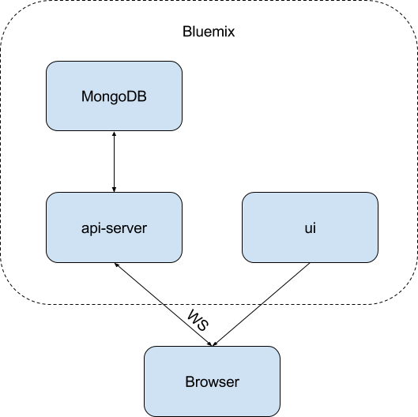

### Run

Install Node.js https://nodejs.org/en/download/

Check version with `node -v`

Install CF CLI https://github.com/cloudfoundry/cli#installers-and-compressed-binaries

Check version with `cf -v`

Create Bluemix account https://console.ng.bluemix.net/registration/

Login with CLI `cf login -u username -o org_name -s space_name -a https://api.ng.bluemix.net`

(other endpoints `https://api.eu-gb.bluemix.net` `https://api.au-syd.bluemix.net`)

Create mongodb instance with name `mongodb-instance` https://console.ng.bluemix.net/catalog/services/compose-for-mongodb

Replace in `api/server/.env` `localhost:27017/iot-saving` with new uri from mongodb credentials

Deploy `api-server` with `cf push`

Replace in `ui/index.html` `RANDOM-PHRASE` with random part of `api-server` uri

Deploy `ui` with `cf push`

### Architecture

